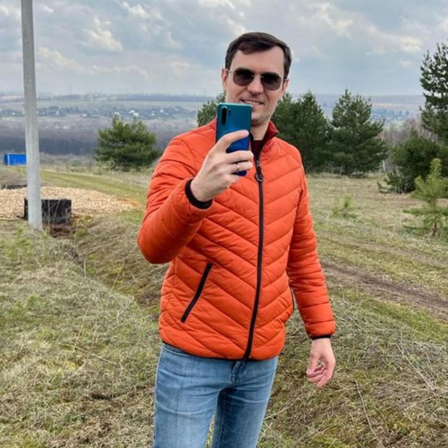
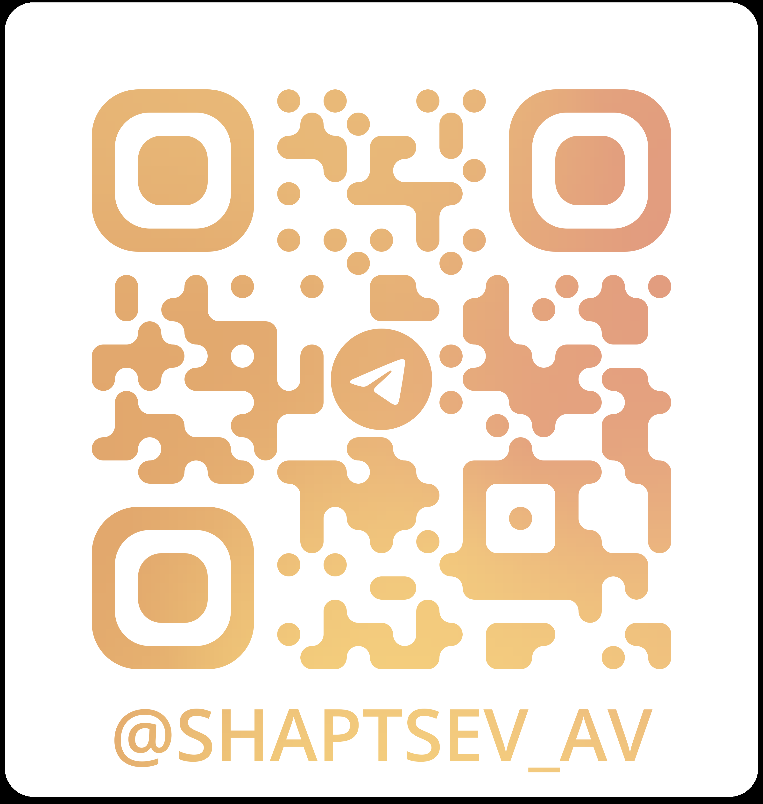

# Александр Шапцев

## В поисках работы (офис / гибридная). Полный рабочий день.
### Москва

***телефон для связи: +7 (910) 404-77-40***

***почта: 89104047740@mail.ru***

***https://t.me/shaptsev_av***

***резюме на [hh.ru](https://vidnoe.hh.ru/resume/c23ccba1ff0ccbc7730039ed1f6d6632777042)***

**Владею основами:**

- [x] [Python](https://netology.ru/sharing/5adee69fa78f90c8583a4cccd00bf8f6?utm_source=social&utm_campaign=certificate_lms );
- [x] фреймворка [Django](https://netology.ru/sharing/feb020ec00fee45be1221bd25e20767f?utm_source=social&utm_campaign=certificate_lms );
- [x] [SQLAlchemy](https://github.com/VolshVs/ORM.Python_DB) и PostgreSQL;
- [x] тестирования, API сторонних сервисов, Web-scrapping, HTML и CSS, CI/CD, Flask, Docker Compose, Asyncio, терминала.

**Портфолио:**

- Подготовка [программы для парсинга данных из pdf](https://github.com/VolshVs/parsing_text_from_pdf) файла на основе регулярных выражений (конкурс для Python-разработчиков от компании О2RUS).
- Выполненное тестовое задание: поиск ссылок в json объекте [(блокнот colab)](https://colab.research.google.com/drive/1j0pK1_tm5k6nIeNWNtEumDoaK57d0IDP?usp=sharing).
- Работа с API Я.Диска и VK на примере [курсовой работы «Резервное копирование»](https://github.com/VolshVs/Coursework-OOP-Backup/tree/main).

**Личные качества:**

- работа на результат;
- ответственность.

